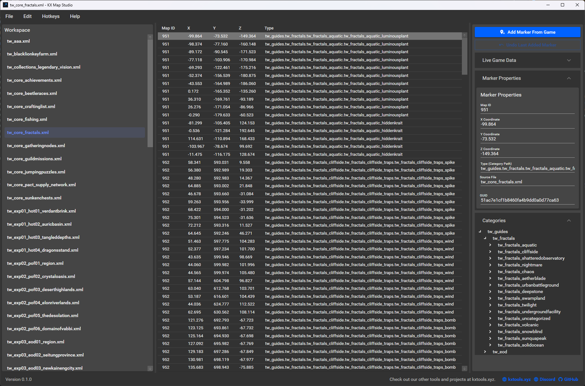

# KX Map Studio

<p align="center">
  
</p>

> ⚠️ **Early Access Notice (v0.1.0):** This is an **early release** and is still under active development. It has not been thoroughly tested, and certain features may not work reliably. **Large marker files may cause issues**, and stability is not guaranteed yet.

---

## GUI Preview

<p align="center">
  
</p>

---

The definitive, open-source desktop application for Guild Wars 2 players to easily **create, edit, and manage their in-game marker routes**!

Tired of manually editing complex XML files for your Guild Wars 2 routes? KX Map Studio is here to make your life easier. Whether you're making a simple farming path, an achievement guide, or a detailed route for your guild events, our tool provides a visual, user-friendly way to get the job done.

---

## What is KX Map Studio?

**KX Map Studio** is a standalone application built for Guild Wars 2 players who want to take control of their in-game routes. It replaces the tricky, manual process of editing marker files with a smooth, visual interface. It's especially useful for:

*   **Route Creators:** Build custom paths, achievement guides, or event routes from scratch with ease.
*   **Route Customizers:** Easily tweak existing marker files from your favorite content creators.
*   **KX Trainer Users:** Create and fine-tune your own marker files for seamless integration with KX Trainer's teleport features.

> ✅ **100% ToS Compliance:** KX Map Studio uses only the official Guild Wars 2 Mumble Link API to access in-game data. It does **not** perform memory reading or DLL injection.

---

## Key Features (v0.1.0)

Our first early release focuses on providing a solid, user-friendly experience for managing single marker files:

*   🗺️ **Visual Map Editing:** Interact with your markers directly in a clear, organized interface.
*   📝 **Simple Properties Editor:** Easily change marker details like position, map ID, and type using friendly controls.
*   ➕ **One-Click Marker Placement:** Add your current in-game position as a new marker with a single click or hotkey (requires Guild Wars 2 running).
*   🔄 **Undo/Redo:** Experiment with confidence, knowing you can always undo your last changes.
*   📂 **Flexible File Handling:** Open, edit, and save standard GW2 marker XML files (`.xml`) or even unpack existing `.taco` archives.
*   💾 **Safe Saving:** Your changes are saved cleanly, preserving the original structure of your files as much as possible.

**Future Feature Alert!** We're planning an integrated **live in-game preview overlay** to let you see your route changes in real-time as you edit!

---

## Getting Started

### For Gamers (Using the App)

1.  **Download:** Grab the latest release from our [GitHub Releases page](https://github.com/kxtools/kx-map-studio/releases).
2.  **Unzip:** Extract the downloaded `.zip` file to a folder of your choice (e.g., `C:\Games\KXMapStudio`). Avoid placing it in system folders like `Program Files`.
3.  **Run:** Launch `KXMapStudio.App.exe`.
4.  **Start Mapping!** Use the "File" menu to create a "New File," "Open File...", or "Open Folder..." to load your existing marker files or start a new project. Make sure Guild Wars 2 is running for live in-game data!

### For Developers (Building from Source)

1.  **Requirements:**
    *   [.NET 8.0 SDK](https://dotnet.microsoft.com/download/dotnet/8.0)
    *   [Visual Studio 2022](https://visualstudio.microsoft.com/) (Community Edition or higher is fine) with the ".NET desktop development" workload installed.
2.  **Clone the Repository:**
    ```bash
    git clone https://github.com/kxtools/kx-map-studio.git
    ```
3.  **Open in Visual Studio:** Open the `KXMapStudio.sln` file.
4.  **Build:** Build the solution (Ctrl+Shift+B). The executable will be in the `bin` folder within the `KXMapStudio.App` project directory (e.g., `KXMapStudio.App\bin\Debug\`).
5.  **Run:** Launch `KXMapStudio.App.exe` from there.

---

## Community & Support

Join our community to ask questions, give feedback, or just hang out!

*   🌐 **Our Website:** Explore our other projects at [kxtools.xyz](https://kxtools.xyz)
*   💬 **Discord:** Connect with us and other users: [https://discord.gg/z92rnB4kHm](https://discord.gg/z92rnB4kHm)
*   🐙 **GitHub:** Report issues, suggest features, or contribute code: [https://github.com/kxtools/kx-map-studio](https://github.com/kxtools/kx-map-studio)

---

## Contributing

We welcome contributions from the community! If you're interested in helping make KX Map Studio even better:

*   **Report Bugs:** Found a glitch? Please open an issue on our [GitHub Issues page](https://github.com/kxtools/kx-map-studio/issues) and provide as much detail as possible.
*   **Suggest Features:** Have an idea for a new feature or an improvement? Open an issue to discuss it!
*   **Code Contributions:** If you'd like to contribute code, please open an issue first to discuss your planned changes. This helps avoid duplicate work and ensures alignment with the project's direction. We aim for clean, readable C# code that follows standard .NET conventions.

---

## Special Thanks

KX Map Studio wouldn't be possible without the incredible work from other projects and the Guild Wars 2 community. A huge shout-out to:

*   **[GW2 Tactical Overlay (TacO)](https://github.com/BoyC/GW2TacO):** The original in-game overlay that inspired us and established the marker pack format we build upon.
*   **[Blish HUD](https://github.com/blish-hud/Blish-HUD):** A fantastic overlay whose architecture and documentation were a great source of inspiration during our development.
*   **[Gw2Sharp](https://github.com/Archomeda/Gw2Sharp):** The essential library that connects KX Map Studio to Guild Wars 2's in-game data, making live features possible.
*   **[Material Design in XAML Toolkit](https://github.com/MaterialDesignInXAML/MaterialDesignInXamlToolkit):** For providing the beautiful and modern UI components that make KX Map Studio look so great.

Thank you for being part of the KX Tools community!